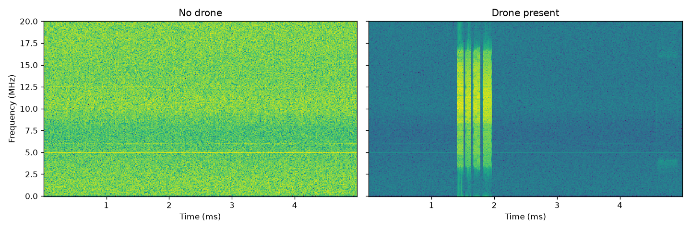
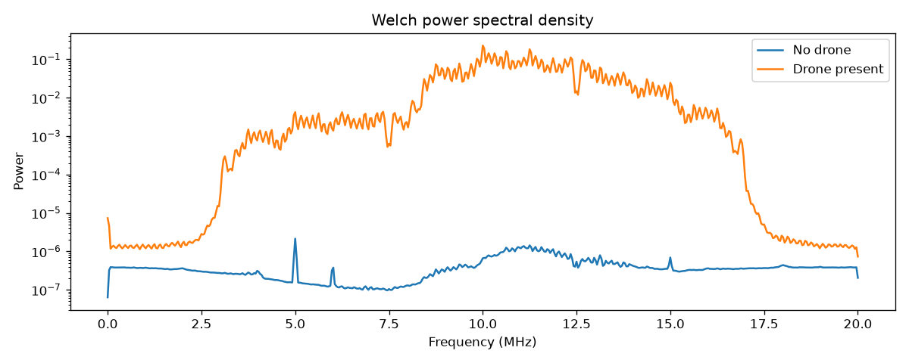
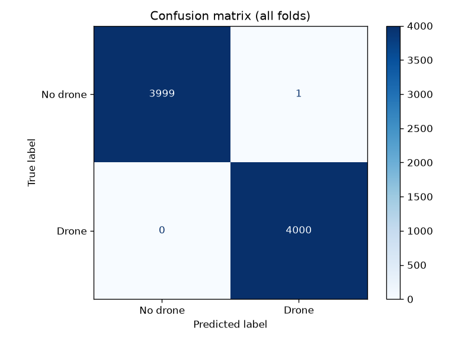
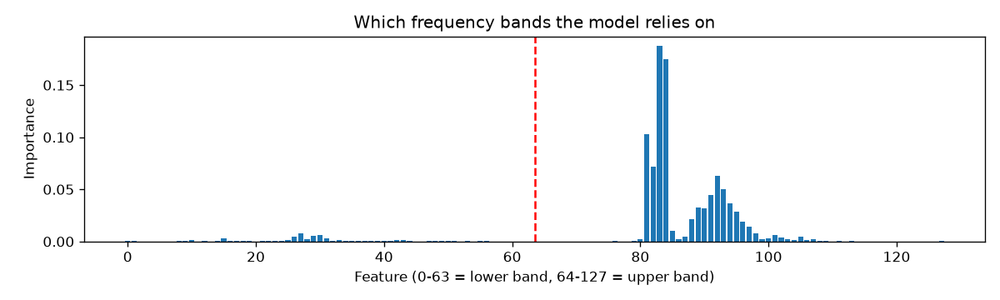

# Drone RF Detection with DSP and Machine Learning

Detecting whether a drone is present from raw 2.4 GHz RF captures, using spectral features and a Random Forest classifier.

## Data
[DroneRF dataset](https://doi.org/10.17632/f4c2b4n755.1) (Al-Sa'd et al., 2019), recorded with two NI USRP-2943R receivers that cover the lower and upper halves of the 2.4 GHz band. I used 8 recordings in total, 4 of background RF activity with no drone and 4 of a Parrot Bebop drone in one flight mode (BUI 10000). The raw data is not included here because of its size.

## What I did
1. **Explored the raw signals** in the time domain, as spectrograms and as Welch power spectral densities.
2. **Built the complex analytic (I/Q) form** of the real-valued captures with a Hilbert transform.
3. **Extracted features** by cutting each recording into 1,000 windows of 0.25 ms and computing log power in 64 frequency bands per receiver, giving 8,000 windows with 128 features each.
4. **Trained a Random Forest** and evaluated it with grouped cross-validation, so windows from the same recording never appear in both the training and the test data.
5. **Implemented a moving-average FIR filter in C++** and checked it against NumPy on 5,000 real samples.

## Results
- Accuracy on recordings the model had never seen was 100% in all four folds.
- The C++ filter matched NumPy exactly (maximum difference 0.0).

The perfect score needs context. The data was recorded in a lab, only one drone and one flight mode were used, and there were just 8 recordings. Detection in open air, with Wi-Fi and Bluetooth sharing the band, would be much harder.






## What I learned
Looking at the raw samples told me almost nothing, but the spectrogram and the power spectrum made the drone's activity easy to see. The feature importance plot showed the model relied almost entirely on the upper half of the band, and within it on two narrow groups of frequencies, while the lower half hardly mattered. I also learned why the test split matters. Neighbouring windows from one recording are nearly identical, so a random split would have let the model see near-copies of its test data, and grouping by recording was the only honest way to measure it. The exact match between C++ and NumPy happened because the samples are whole numbers, so none of the sums in the filter had to be rounded.

## How to run
```
pip install -r requirements.txt
python 01_explore.py
python 02_features.py
python 03_train.py
g++ -O2 -static -o cpp/moving_average.exe cpp/moving_average.cpp
python 04_check_cpp.py
```
Put the DroneRF .csv files in `data/raw/` first.