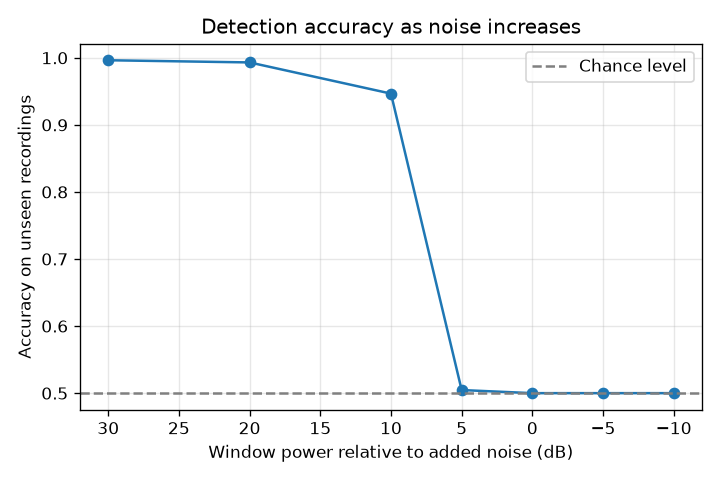

# Drone RF Detection with DSP and Machine Learning

Detecting whether a drone is present from raw 2.4 GHz RF captures, using Welch spectral features and a Random Forest, evaluated only on recordings the model has never seen.


## Results at a glance

| Test | Result |
|---|---|
| Random Forest, 128 band-power features, grouped 4-fold cross-validation | 100% accuracy on unseen recordings |
| One-feature baseline (average power of the upper receiver) | 50% (chance level) |
| Noise robustness | At least 94.7% down to 10 dB, then falls to chance at 5 dB (see below) |
| C++ moving-average FIR filter vs NumPy | Identical output on 5,000 real samples |

## Data
[DroneRF dataset](https://doi.org/10.17632/f4c2b4n755.1) (Al-Sa'd et al., 2019), recorded with two NI USRP-2943R receivers that cover the lower and upper halves of the 2.4 GHz band. I used 8 recordings, 4 of background RF activity with no drone and 4 of a Parrot Bebop drone in one flight mode (BUI 10000). The raw data is not included because of its size.

## Method
1. **Explored the raw signals** in the time domain, as spectrograms and as Welch power spectral densities.
2. **Built the complex analytic (I/Q) form** of the real-valued captures with a Hilbert transform.
3. **Extracted features** by cutting each recording into 1,000 windows of 0.25 ms and computing log power in 64 frequency bands per receiver, giving 8,000 windows with 128 features each.
4. **Trained a Random Forest** and evaluated it with grouped cross-validation, so windows from the same recording never appear in both training and test data.
5. **Compared against a one-feature baseline** to measure how hard the task really is.
6. **Tested robustness** by adding white Gaussian noise to the unseen recordings and measuring accuracy at each noise level.
7. **Implemented a moving-average FIR filter in C++** and checked it against NumPy.

## Which frequencies matter


Almost all of the importance sits in the upper receiver. The strongest bands lie between about 5.5 and 6.5 MHz of its capture, with a second, weaker group between about 7.5 and 10.5 MHz, while the lower receiver contributes very little. Together with the baseline result, this shows the drone is recognised by where its energy sits in the spectrum, not by how much energy there is.

## How much noise the detector tolerates


Noise is added relative to each window's own power, so 0 dB means the added noise is as strong as the window itself. The recordings already contain receiver noise, so this axis is not the true SNR of the drone signal. Accuracy holds at 99% or more down to 20 dB and at 94.7% at 10 dB, then collapses to chance at 5 dB. The drop is sharp because the model was trained only on clean recordings, so once added noise lifts the noise floor across all bands, the band powers no longer look like anything it has seen. Training with noise-augmented windows would be the natural next step.

## Limitations
The perfect score needs context. The data was recorded in a lab, with one drone in one flight mode, and only 8 recordings. The overall power of a window does not separate the classes at all, since a one-feature baseline only reaches chance level. The difference lies in the shape of the spectrum, which the 128 band-power features capture, so the feature design is what makes detection possible here. Detection in open air, with Wi-Fi and Bluetooth sharing the band, would be much harder.

## What I learned
Looking at the raw samples told me almost nothing, but the spectrogram and the power spectrum made the drone's activity easy to see. I also learned why the test split matters. Neighbouring windows from one recording are nearly identical, so a random split would have let the model see near-copies of its test data, and grouping by recording was the only honest way to measure it. The exact match between C++ and NumPy happened because the samples are whole numbers, so none of the sums in the filter had to be rounded.

## How to run
Put the DroneRF .csv files in `data/raw/` first.
```
pip install -r requirements.txt
python 01_explore.py
python 02_features.py
python 03_train.py
python 05_baseline.py
python 06_noise_robustness.py
g++ -O2 -static -o cpp/moving_average.exe cpp/moving_average.cpp
python 04_check_cpp.py
```

## Files
| File | What it does |
|---|---|
| `common.py` | Paths, sampling rate, window length, file loading |
| `features_lib.py` | The band-power feature function shared by all scripts |
| `01_explore.py` | Time-domain, spectrogram, PSD and I/Q plots |
| `02_features.py` | Builds the 8,000 x 128 feature table |
| `03_train.py` | Grouped cross-validation, confusion matrix, feature importance |
| `04_check_cpp.py` | Compares the C++ filter with NumPy |
| `05_baseline.py` | One-feature baseline |
| `06_noise_robustness.py` | Accuracy as noise is added |